# AI-Driven Bioinformatics Data Platform

This project is a full-stack, enterprise-grade platform for processing and analyzing large-scale genomic data. It implements a scalable, event-driven microservices architecture to orchestrate a bioinformatics pipeline, from raw sequence data ingestion to AI-powered predictive analysis. Designed for scalability, reproducibility, accessibility, and long-term evolvability.

---

## The Problem

Genomic research and clinical diagnostics are hampered by significant data engineering challenges. The massive volume of data from next-generation sequencing (NGS) platforms creates bottlenecks in traditional analysis pipelines. These pipelines are often monolithic, script-heavy, and tightly coupled to specific computing environments, leading to critical issues. Key operational challenges: scalability, reproducibility, accessibility, and difficulty integrating with cloud-native observability and dashboards.

### Scalability
Traditional tools struggle to process terabyte-scale datasets efficiently, causing long delays from sample sequencing to actionable insight.

### Reproducibility
Analyses are notoriously difficult to reproduce due to variations in software versions, dependencies, and execution environments.

### Accessibility
Most powerful bioinformatics tools are command-line driven, creating a high barrier to entry for clinicians and biologists who are the primary domain experts.

### Integration and Evolvability
Traditional bioinformatics pipelines are often monolithic and tightly coupled, making them difficult to update or modify.

---

## The Solution

This platform addresses these challenges by applying modern software engineering principles to the bioinformatics domain.

The core of the solution is an event-driven architecture built on a fleet of containerized microservices. This design decouples each stage of the pipeline, allowing for independent scaling, development, and maintenance. The platform automates the entire workflow, from the initial registration of a raw data file to the final prediction of disease risk, and is designed to be operated through a simple user interface. Here's how the 4 above architectural problems are solved.

#### 1. Scalibility
The system is designed to handle terabytes of data from Next-Generation Sequencing (NGS) technologies. It uses a Docker Hub for containerization and a Kafka pipeline for a distributed event bus, enabling horizontal scaling to meet varying data volume demands. It prevents processing bottlenecks caused by large data deluge, which renders single-machine scripts computationally infeasible. It shifts from a batch-processing paradigm to an event-driven, real-time processing architecture for continuous data streams.
#### 2. Reproducibility
The architecture directly addresses the "reproducibility crisis" by using Docker to containerize every tool and service, ensuring an immutable and consistent execution environment.
The event-driven nature of Kafka provides a durable, replayable log of all data transformations, creating an auditable trail of data provenance.
It avoids the "spaghetti code" and brittle pipelines often found in traditional bioinformatics, which hinder scientific collaboration and verification.
#### 3. Accessibility
It abstracts the complexity of command-line tools behind a modern, interactive React dashboard, democratizing data analysis.
This enables a wider range of scientific stakeholders, including clinicians and wet-lab biologists, to explore data, monitor analyses, and interpret results directly without deep command-line expertise.
#### 4. Integration and Evolvability
The microservices architecture breaks down monolithic, tightly coupled pipelines into independent, loosely coupled services.
This allows individual components (e.g., sequence aligner, variant caller) to be updated, replaced, or scaled independently without impacting the entire system, fostering agility and long-term maintainability.

---

## Architecture & System Flow

The system is composed of several independent microservices that communicate asynchronously through an Apache Kafka event bus. This decoupled approach ensures resilience and scalability.

```mermaid
%%{init: {"theme": "dark"}}%%
graph TD
    %% Title
    A[Scientist 👩‍🔬] -->|1. HTTP (localhost:3000)| B[dashboard-ui (React) 🌐]

    %% Frontend
    subgraph Docker Compose 🐳
        subgraph Frontend
            B -->|"2. HTTP POST /api/ingest"| C[ingestion-service (Spring Boot)]
        end

        %% Backend Processing Services
        subgraph Backend_Services[Backend Services ☕]
            C -->|"3. raw-file-registered"| D[(Kafka Cluster)]
            D -->|"4. raw-file-registered"| E[alignment-service (Spring Boot)]
            E -->|"5. alignment-complete"| D
            D -->|"6. alignment-complete"| F[variant-calling-service (Spring Boot)]
            F -->|"7. variants-called"| D
            D -->|"8. variants-called"| G[persistence-service (Spring Boot)]
            G -->|"9. write samples, variants"| H[(MongoDB)]
            E -->|"read fileUri"| I[(Shared File System)]
        end

        %% Backend AI Service
        subgraph ML_Service[ml-service (FastAPI) 🧠]
            J[model.joblib (XGBoost)]
            ML[ml-service Container :8001->8001]
            ML --> J
        end

        %% Infrastructure
        subgraph Infrastructure[Infrastructure ⚙️]
            subgraph Kafka[Apache Kafka]
                D --> Z[Zookeeper 🦓]
            end
            subgraph DB[MongoDB]
                H --> H1[(samples collection)]
                H --> H2[(variants collection)]
            end
            I[/data (Docker Volume)/]
        end
    end

    %% ML Data Flow
    A -->|"HTTP POST /train"| ML
    ML -->|"query variants"| H
    B -->|"10. HTTP POST /predict"| ML
    ML -->|"11. prediction result"| B

    %% Dependencies
    C -.->|"depends_on"| D
    E -.->|"depends_on"| D
    F -.->|"depends_on"| D
    G -.->|"depends_on"| D
    G -.->|"depends_on"| H
    ML -.->|"depends_on"| H

```

### docker-commpose.yml
This single file will serve as the reproducible, version-controlled definition of our entire system.This file defines three services running inside isolated docker containers:-
- Mongodb : MongoDB database
- Kafka : Kafka message bus
- Zookeeper : Kafka uses another service, zookeeper, to manage its state and configuration in a distributed environment.
Docker Compose has created a virtual network where these services can find each other by name (e.g., the kafka service can talk to the zookeeper service). We have also exposed their ports to your local machine so our future applications can connect to them.


### ingestion-service Microservice (Java/Spring Boot)
The entry point for the platform. It receives requests to process a new data file and publishes a raw-file-registered event to Kafka. It uses the Claim Check architecture to handle large data files by passing a reference (URI) instead of the file itself.   

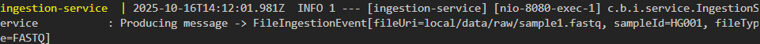   

### alignment-service Microservice (Java/Spring Boot)
A consumer of raw-file-registered events. It simulates the computationally intensive task of aligning raw DNA sequences to a reference genome and, upon completion, produces an alignment-complete event.   

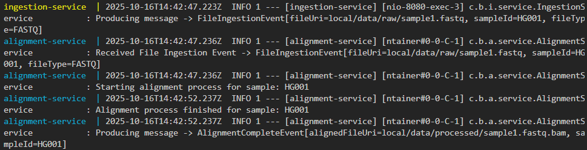

### variant-calling-service Microservice (Java/Spring Boot)
A consumer of alignment-complete events. It simulates the process of identifying genetic variants (SNPs) from the aligned data and produces a variants-called event. This will be the signal that the raw data has been fully processed and is ready for storage and analysis.

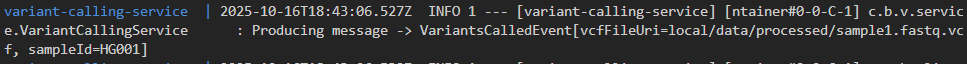

### persistence-service Microservice (Java/Spring Boot)
A consumer of variants-called events. Its sole responsibility is to connect to the MongoDB database and save the sample metadata and variant information  in a structured, permanent format. This is the step that transforms our fleeting events into a queryable, long-term dataset—the foundation for all the analysis and machine learning.

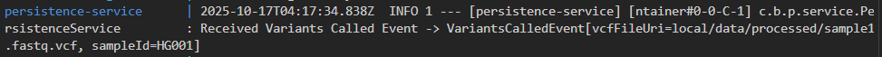   
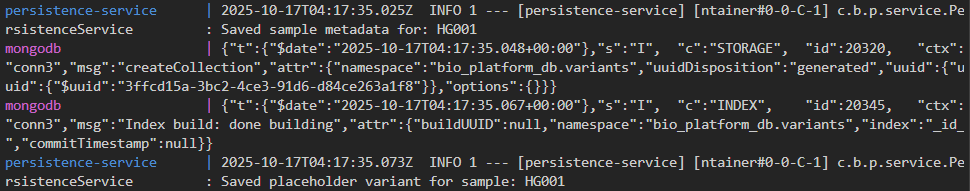    
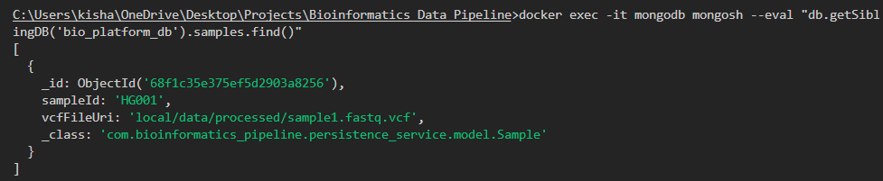     

### ml-service Microservice (Python/FastAPI/XGBoost)
The intelligence layer. It provides API endpoints to train an XGBoost model on the data stored in MongoDB and to serve real-time predictions for a given sample.

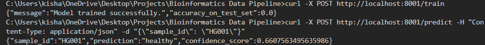

### dashboard-ui (React)
The user-facing frontend. It provides a simple interface to initiate a pipeline run, monitor its status, and retrieve a prediction from the ml-service.

---

## Technology Stack

Backend Services: Java 17, Spring Boot 3  
Machine Learning Service: Python 3.9, FastAPI, Pandas, Scikit-learn, XGBoost  
Frontend: React.js  
Event Bus: Apache Kafka  
Database: MongoDB  
Containerization: Docker and Docker Compose

---

## Getting Started

Follow these instructions to set up and run the platform on your local machine.

---

### Prerequisites

Ensure you have the following software installed.

- Docker Desktop to run the containerized services.
- Java Development Kit (JDK) 17 to build the Java microservices.
- Python Installed.
- Node.js and npm to build the React dashboard.  
- SRA Toolkit to download the real-world genomic data.
- Running MongoDB

---

### Setup and Launch

#### Clone the Repository

using git clone ..

#### Download Real-World Genomic Data

This project is designed to work with large genomic files. The repository does not contain this data. You must download it manually.

To download Genomic Data, you will have to first Install NCBI SRA Toolkit. Install it from here <https://github.com/ncbi/sra-tools/wiki/02.-Installing-SRA-Toolkit>

Navigate to the ai-bio-platform/data/raw directory and use the SRA Toolkit to download the sample data for HG001.  
`cd data/raw`  
First, pre-fetch the data (this might take a few minutes)  
`prefetch SRR062634`  
Next, convert it to the standard FASTQ format  
`fasterq-dump --split-files SRR062634`

This will create a large SRR062634_1.fastq file in the data/raw directory.

#### Launch the Platform

From the root directory, run the following command. This will build the Docker images for all services and start the entire platform.

`docker-compose up --build`

The initial build may take several minutes. Wait until all services have started and the logs have stabilized.  
**Note :** For the first time you might face timeout issue and automatic graceful shutdown. In that case simply re-run the above command.

---

## How to Use the Platform

The platform can be operated either through the React dashboard or by interacting with the APIs directly.

---

### Using the React Dashboard

Open your web browser and navigate to http://localhost:3000. 

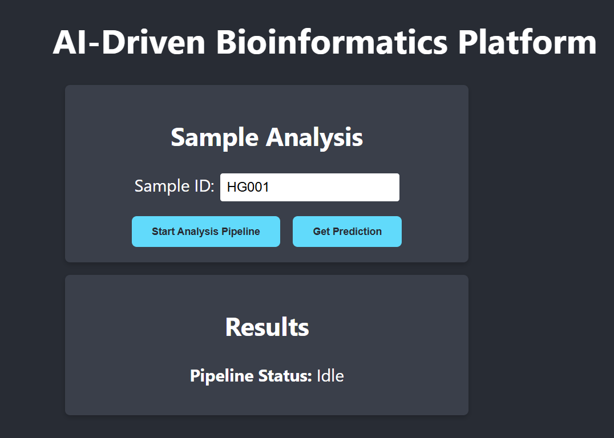

Click the "Start Analysis Pipeline" button. This will trigger the entire backend workflow. You can observe the logs in your terminal to see the event flow through each microservice.   

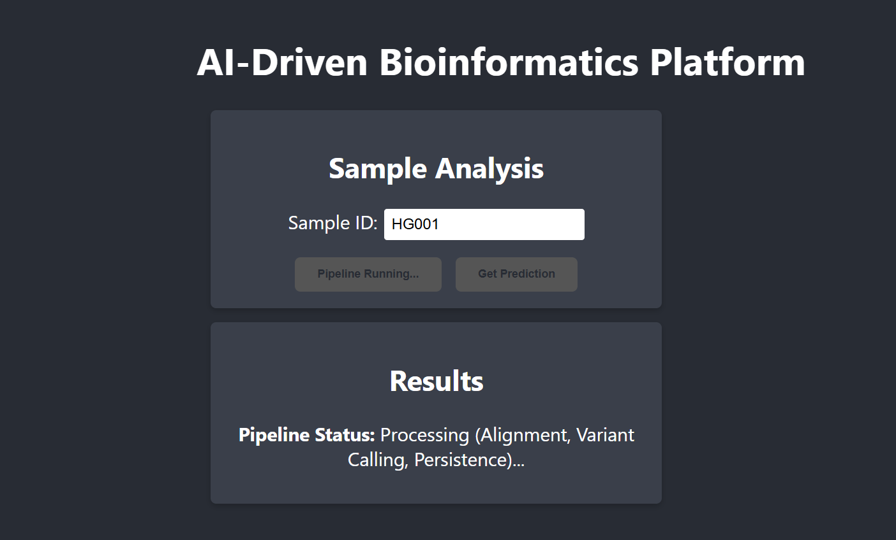 

After about 15-20 seconds (to simulate the processing time), the pipeline status will update to "Complete."

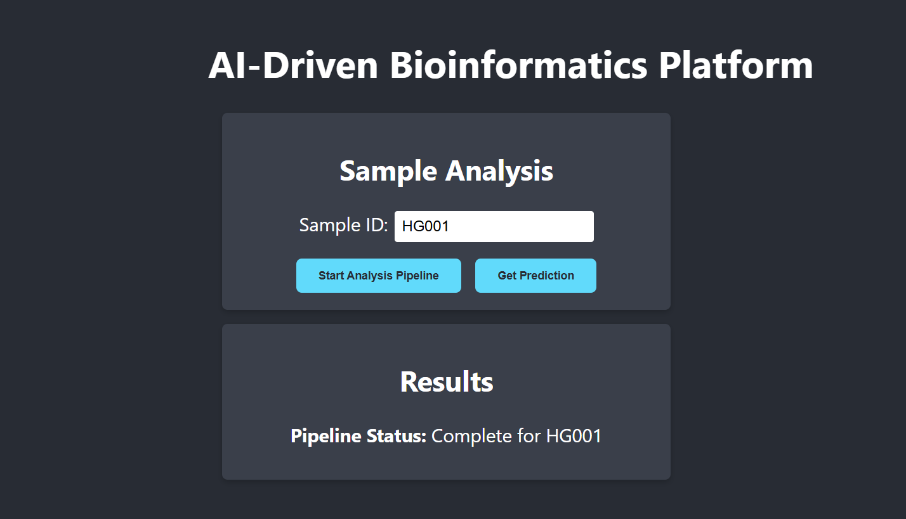

To generate the prediction, first voluntarily train the XGBoost model using following command:-  
`curl -X POST http://localhost:8001/train
{"message":"Model trained successfully.","accuracy_on_test_set":0.0}`  
Click the "Get Prediction" button. The dashboard will call the ml-service and display the disease risk prediction for the sample. 

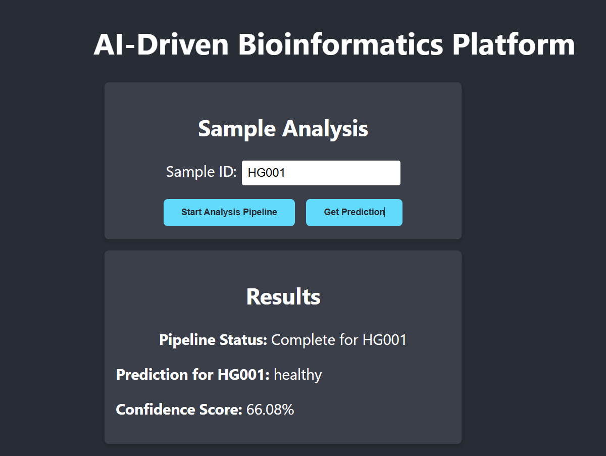

---

### Using the APIs Directly

You can also interact with the services using curl in a separate terminal.

#### Trigger the Pipeline

`curl -X POST http://localhost:8080/api/ingest -H "Content-Type: application json" -d "{\"fileUri\": \"/data/raw/SRR062634_1.fastq\", \"sampleId\": \"HG001\", \"fileType\": \"FASTQ\"}"`  

#### Train the Model

This only needs to be done once after data has been persisted.

`curl -X POST http://localhost:8001/train`  

#### Get a Prediction

`curl -X POST http://localhost:8001/predict -H "Content-Type: application/json" -d "{\"sample_id\": \"HG001\"}"`  

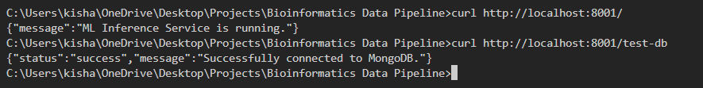

## Reference
https://pmc.ncbi.nlm.nih.gov/articles/PMC5580401/#S10   
https://codemia.io/knowledge-hub/path/how_to_stream_large_files_through_kafka  
https://www.confluent.io/learn/kafka-message-size-limit/  
https://akfpartners.com/growth-blog/dont-push-a-bowling-ball-down-a-garden-hose
https://learn.microsoft.com/en-us/azure/architecture/patterns/claim-check  
https://dataengineering.wiki/Concepts/Software+Engineering/Claim+Check+Pattern
https://pmc.ncbi.nlm.nih.gov/articles/PMC11854617/  

#### 1. Architectural concepts
https://www.ibm.com/think/topics/event-driven-architecture
https://microservices.io/patterns/microservices.html
https://academic.oup.com/bioinformatics/article/35/19/3752/5372675
https://www.researchgate.net/publication311792411_The_growing_need_for_microservices_in_bioinformatics

#### 2. Bioinformatics Context & challenges
https://gatk.broadinstitute.org/hc/en-us  
https://www.researchgate.net/figure/Comparison-of-tools-used-in-GATK-best-practices-pipeline-and-SparkGA_tbl1_319284382  
https://pmc.ncbi.nlm.nih.gov/articles/PMC4184249/  
https://galaxyproject.org/support/account-quotas/  
https://www.nextflow.io/docs/latest/process.html

#### 3. Implementation Guide
https://blog.stackademic.com/10-best-practices-for-building-scalable-spring-boot-microservices-266143adc3ea  
https://www.genomicsengland.co.uk/news/mongodb-used-to-power-data-science-for-100k-project  
https://blog.panoply.io/mongodb-best-practices
https://fastapi.tiangolo.com/tutorial/  
https://spacelift.io/blog/docker-ci-cd  

#### 4. Data Source and Formats 
https://www.ncbi.nlm.nih.gov/sra  
https://www.internationalgenome.org/data/  
https://en.wikipedia.org/wiki/FASTQ_format  
https://github.com/ncbi/sra-tools/wiki/02.-Installing-SRA-Toolkit  

#### 5. Machine Learning
https://pmc.ncbi.nlm.nih.gov/articles/PMC11854617/  
https://www.bmj.com/content/384/bmj-2023-074819  
https://www.geeksforgeeks.org/machine-learning/difference-between-pca-vs-t-sne/  
https://bio.libretexts.org/Workbench/Modern_Genetics/04%3A_Recombination_linkage_and_mapping/4.04%3A_Chi-square_tests_how_well_genetic_data_fit_a_hypothesis
